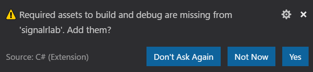
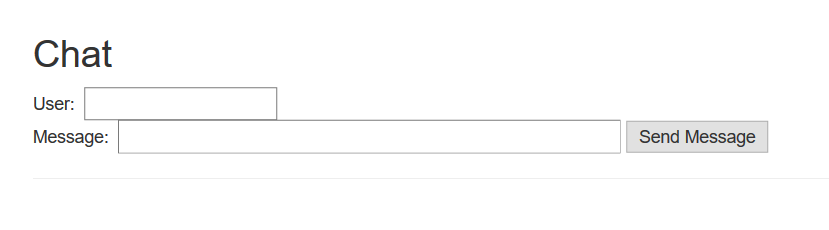
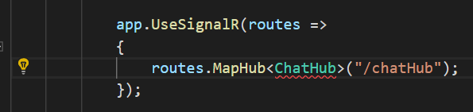
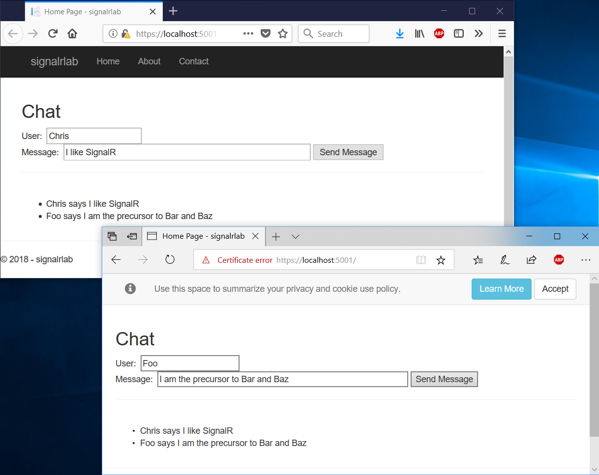

# ASP.NET Core SignalR Lab

## Prerequisites

* Visual Studio Code - *([ Download ](https://code.visualstudio.com/download))*

* .NET Core SDK 2.1.300 or later - *([ Download ](https://www.microsoft.com/net/download/dotnet-core/sdk-2.1.302))*

* C# Extension for Visual Studio Code - *([ Download ](https://marketplace.visualstudio.com/items?itemName=ms-vscode.csharp/))*
* NPM 5.6.0 or later. (Optional for this lab, details below). Install Node.js 8.11.3 LTS or later  - *([ Download ](https://nodejs.org/en/))*

## Create a new web project
* From the command line, in a folder of your choosing, type the following:

        dotnet new mvc -o signalrlab

    This creates a new subfolder called middleware with your project in it.  The **dotnet restore** command will automatically be run for you.

* Open this new folder in Visual Studio Code

    You may get a notification that required assets are missing.  Go ahead and click **Yes** to add those now.

   

* Make sure you can debug the application

## Replace the Index View
We're not going to need the Index view to be so fancy and colorful.  

* Delete the Index.cshtml file at Views\Home\Index.cshtml
* Replace it with the file at lab_files\Index.cshtml

You may have noticed our new view expects a utils.js script file.
* Copy the utils.js file from the lab_files folder to the project's wwwroot\js folder

Notice that this is a simple view for a real-time chat application.

 

## Create the Chat Hub
* Create a new top level folder called Hubs
* Create a new file named ChatHub.cs and add the following code:

        using System.Threading.Tasks;
        using Microsoft.AspNetCore.SignalR;

        namespace signalrlab.Hubs
        {
            public class ChatHub : Hub
            {
                public async Task SendMessage(string user, string message)
                {
                    await Clients.All.SendAsync("ReceiveMessage", user, message);
                }
            }
        }

We have now created our first hub.  We also added a method that clients can call and called back a method in client script that we haven't even written yet.

## Configure the project to use SignalR
We have to configure the ASP.NET middleware pipeline to use SignalR.  This will allow it to apply conventions to detect our hubs and connect clients to them.

* Open the Startup.cs file in your project for editing
* Add the following line to the bottom of the ConfigureServices method
        
        services.AddSignalR();

The entire ConfigureServices method now looks like this:

        public void ConfigureServices(IServiceCollection services)
        {
            services.Configure<CookiePolicyOptions>(options =>
            {
                // This lambda determines whether user consent for non-essential cookies is needed for a given request.
                options.CheckConsentNeeded = context => true;
                options.MinimumSameSitePolicy = SameSiteMode.None;
            });

            services.AddMvc().SetCompatibilityVersion(CompatibilityVersion.Version_2_1);

            services.AddSignalR();
        }

* Add the following route configuration to the Configure method, before Mvc Routes are configured

            app.UseSignalR(routes =>
            {
                routes.MapHub<ChatHub>("/chatHub");
            });

The entire Configre method now looks like this:

    public void Configure(IApplicationBuilder app, IHostingEnvironment env)
            {
                if (env.IsDevelopment())
                {

                    app.UseDeveloperExceptionPage();
                }
                else
                {
                    app.UseExceptionHandler("/Error");
                    app.UseHsts();
                }

                app.UseHttpsRedirection();
                app.UseStaticFiles();
                app.UseCookiePolicy();
                app.UseCors("CorsPolicy");
                app.UseSignalR(routes =>
                {
                    routes.MapHub<ChatHub>("/chatHub");
                });
                app.UseMvc();
            }

You may notice the editor calling out that ChatHub is an unknown type. If you click on the type, the yellow lightbulb to the left will help us add the using statement needed to the project:

 

* Click on the bulb and select using signalrlab.Hubs; so that the following using statement is added to the top of the file

        using signalrlab.Hubs;

## Add the SignalR JavaScript Client to the project

### Using NPM (OPTIONAL FOR THIS LAB)
The JavaScript client is contained in an NPM package.  You could run the following commands from the console:
        
        npm init -y
        npm install @aspnet/signalr
This will add the SignalR client to your project.  At this point you can find the client code in the node_modules\@aspnet\signalr\dist\browser folder.  
Many projects will have a strategy to consume these packages, place the files in a location, and update them for the lifetime of the project.  For this lab, you may skip this by following the next section.

### LAB OPTION: Copy the SignalR client into the project from the lab_files

* Create a signalr subfolder under the wwwroot/lib folder path in your project
* Copy the signalr.js file to this new folder

## Write the JavaScript Client Code to enable Chat
* Create a new file in the wwwroot/js folder called chat.js

* Add the following code to chat.js to construct the SignalR Hub Connection:

        const connection = new signalR.HubConnectionBuilder()
            .withUrl("/chatHub")
            .build();

* Add the following code to chat.js to declare the function that the SignalR will call back into from C#:

        connection.on("ReceiveMessage", (user, message) => {
            const li = document.createElement("li");
            li.textContent = encodeString(user) + " says " + encodeString(message);
            document.getElementById("messagesList").appendChild(li);
        });

* Add the following code to chat.js to start the connection:

        connection
            .start()
            .catch(err => console.error(err.toString()));

* Add the following code to wire up the button click to a function that calls the SignalR hub with the user's name and message:

        document.getElementById("sendButton").addEventListener("click", event => {
            const user = document.getElementById("userInput").value;
            const message = document.getElementById("messageInput").value;
            connection.invoke("SendMessage", user, message)
                .catch(err => console.error(err.toString()));
            event.preventDefault();
        });

## Add the new scripts to the Index view
* Add the following lines of code at the very bottom of Index.cshtml

        
        

## Run the project and open multiple browsers
Enter a value for the User and the Message.  Open a second browser and navigate to the same page.  When you click Send Message you will see that both browsers update at the same time.

Sample Output:
 

## Seeing it work
* Consider adding a breakpoint to the ChatHub's SendMessage method
* Consider adding a breakpoint to the connection.on("ReceiveMessage") callback in chat.js

*Learn more at the version of this lab from the official Microsoft Docs: [Get started with SignalR on ASP.NET Core](https://docs.microsoft.com/en-us/aspnet/core/tutorials/signalr?view=aspnetcore-2.1&tabs=visual-studio)*

## Detecting a new connection

* Add the following method to the ChatHub.cs file

        public override Task OnConnectedAsync()
        {
            base.OnConnectedAsync();
            Clients.All.SendAsync("UserLogin", Context.ConnectionId);
            return Task.CompletedTask;
        }

* Add the following method to chat.js just before the connection.start call

        connection.on("UserLogin", (id) => {
            const li = document.createElement("li");
            li.textContent = "Connection Id: " + encodeString(id) + " just joined.";
            document.getElementById("statusList").appendChild(li);
        });

* Add the following to the Index.cshtml view so that you are creating a new list under the messagesList. It will be before the script tags and before the last closing div tag.

        

            
&nbsp;

            

                <ul id="statusList"></ul>
            

        
   

## Detecting a new disconnection
* Add the following method to the ChatHub.cs file

        public override Task OnDisconnectedAsync(System.Exception exception)
        {
            base.OnDisconnectedAsync(exception);
            Clients.All.SendAsync("UserLogout", Context.ConnectionId);
            return Task.CompletedTask;
        }       

* Add the following method to chat.js just before the connection.start call

        connection.on("UserLogout", (id) => {
            const li = document.createElement("li");
            li.textContent = "Connection Id: " + encodeString(id) + " just left.";
            document.getElementById("statusList").appendChild(li);
        });

## Narrowing down who receives a message
Why should you receive a notification that you joined, you already know!

* Replace the code in OnConnectedAsync that notifies clients a user has connected so that it only notifies other users using this code:

        Clients.Others.SendAsync("UserLogin", Context.ConnectionId);

## Let's add an Admin group
SignalR supports groups as well, let's make it so only Administrators see the status messages.  We can do this entirely in the hub in this case.

* Change the SendMessage method so it now looks like this

        public async Task SendMessage(string user, string message)
        {
            if (user.StartsWith('A'))
            {
                // let's make this user an admin
                await Groups.AddToGroupAsync(Context.ConnectionId, "Admin");
            }
            else
            {
                await Groups.RemoveFromGroupAsync(Context.ConnectionId, "Admin");
            }

            await Clients.All.SendAsync("ReceiveMessage", user, message);
        }

* Replace the code in OnConnectedAsync that notifies clients a user has connected so that it only notifies those who have been made members of the Admin group using this code:

        Clients.Group("Admin").SendAsync("UserLogin", Context.ConnectionId);

* Replace the code in OnDisconnectedAsync that notifies clients a user has disconnected so that it only notifies those who have been made members of the Admin group using this code: 

        Clients.Group("Admin").SendAsync("UserLogout", Context.ConnectionId);
