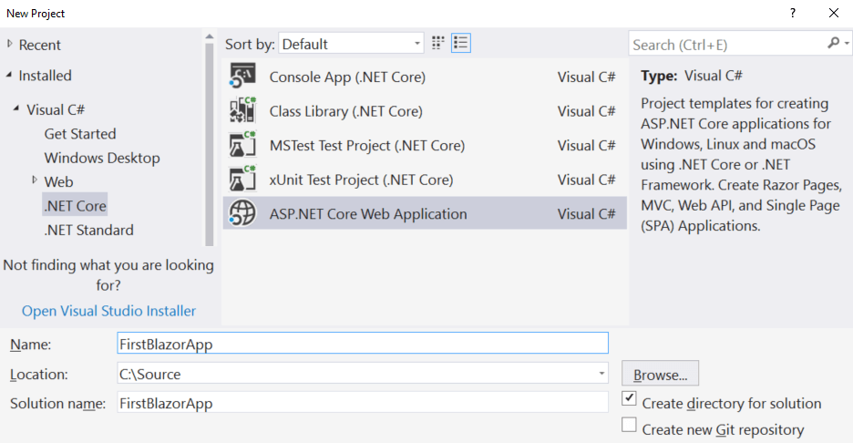
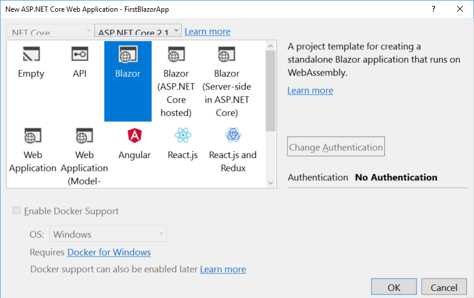

# ASP.NET Blazor Hands-On Lab

## Meetup and Replay information

### YouTube replay
You may watch a replay of this meetup and lab at our YouTube channel. Please like the video so we know to produce more of this type of content.  Please subscribe to the channel to get updates whenever we add more content from our meetups and events!

https://www.youtube.com/watch?v=q1ca_Als86g

### Join the Philly.NET Meetup
For information on future streams and events, please be sure to join the meetup at:

https://www.meetup.com/Philly-NET/

### Recorded Live On Mixer
This lab was presented live on August 8th, 2018 at Philly.NET's Mixer channel: https://mixer.com/PhillyDotNet

We welcome everyone to join the Mixer chatroom and ask questions that will be relayed directly to the speaker.

## PLEASE NOTE
Blazor is an experimental project and is not ready for production.  It is not even released as an alpha.  Significant changes to APIs and design are likely to occur and there is no official word on any timeframes or if the project will be seen through to completion.

If you like Blazor, consider using the watch and star features of GitHub to indicate your interest, and contribute to the work or the discussion about issues. (Last updated: 8/7/2018)

[Official ASP.NET Blazor Repository](https://github.com/aspnet/blazor)

## Prerequisites
The best development experience right now is using Visual Studio 2017.
* Install [Visual Studio 2017 15.7](https://visualstudio.microsoft.com/vs/) or later with the *"ASP.NET and web development"* workload selected during installation.

* .NET Core SDK 2.1.300 or later - *([Download](https://www.microsoft.com/net/download/dotnet-core/sdk-2.1.302))* Make sure when you execute the `dotnet --version` command that the response is ***at least*** 2.1.300 *(SDK version [2.1.302](https://www.microsoft.com/net/download/dotnet-core/sdk-2.1.302) is preferred due to it containing security fixes, but for a lab any 2.1.300 or later should work)*.

* Install the latest [Blazor Language Services extension](https://marketplace.visualstudio.com/items?itemName=aspnet.blazor) from the Visual Studio Marketplace. *([Download](https://marketplace.visualstudio.com/items?itemName=aspnet.blazor))*

    ### You may use Visual Studio Code, but some debugging and editing experiences are not available yet.

* Visual Studio Code - *([Download](https://code.visualstudio.com/download))*
    *  Make sure the [C# Extension](https://marketplace.visualstudio.com/items?itemName=ms-vscode.csharp) is installed. *([Download](https://marketplace.visualstudio.com/items?itemName=ms-vscode.csharp))*

### All participants must install the Blazor templates at the command line:
    dotnet new -i Microsoft.AspNetCore.Blazor.Templates
*(More information on [dotnet new](https://docs.microsoft.com/en-us/dotnet/core/tools/dotnet-new?tabs=netcore21))*

## Create your first Blazor app
### File > New Project
In Visual Studio, From the File > New Project menu, select a new ASP.NET Core Web Application:

### New Blazor Application
In Visual Studio, select **Blazor** in the New ASP.NET Core Web Application dialog:

#### (Creating Project from Command Line)
Alternatively, you may also create this application from the command line with:

    dotnet new blazor -o FirstBlazorApp

*(This creates a new blazor app in the FirstBlazorApp subfolder from your current command line location.)*

## Run the new Blazor App
Go ahead and run the new app via IIS Express by pressing **F5** and check out the application.

*(If using Visual Studio Code or another editor, you should run the application using `dotnet run` from the command line)*

This application is running completely in the client. Don't believe it?  Open your web browser developer tools (F12) and look at the Network section.

Reload the page to see the assets load from the server.  Notice that when you switch between the Home "tab" and the Counter "tab", no new network calls are made.  Everything is being updated in the client even though there is no JavaScript code in the application.

You can also click the button in the Counter tab, and the page is updated with the click count.  No page refresh or server-side request is made.

*(You might notice that clicking on the **Fetch data** tab causes a network call, but this is to obtain the JSON to build the table, much like an HTTP request. The browser is all still updated client-side!)*

## Adding a new page
Let's add a new page that represents a team roster.

Add a new file to the Pages folder named **Roster.cshtml**.  You can also do this by right-clicking the Pages folder and choosing Add New Item... and creating a Razor View.  

*(Blazor tooling is still incomplete, so you can accomplish the same thing by just creating a Roster.cshtml text file.)*

### First steps
Type the following code into **Roster.cshtml**.  You will paste a complete implementation later, but try to type in this small sample.

    @page "/roster"
    @inject HttpClient Http

    <h1>Team Roster</h1>

    @if (roster == null)
    {
        
<em>Loading...</em>

    }
    else
    {
        <pre>@roster</pre>
    }

    @functions {
        string roster;
    }

When you run this, you will find you have to navigate to `/Roster` yourself.  We have not added anything to the navigation menu, yet.

You will find that you have the layout, but the page never updates beyond "Loading...".  That's because we aren't taking any action in the page.

 ### Dependency injection

Add the following `@inject` directive at the top of the file (under the `@page` directive) to gain access to the .NET HttpClient:

    @inject HttpClient Http

### Blazor page lifecycle
We can take action when a Blazor page is loaded, still writing C# code that will be executed in the browser.     

Add the following function to the `@functions` section:

    protected override async Task OnInitAsync()
    {
        roster = await Http.GetStringAsync($"https://randomuser.me/api/?results=10");
    }

At least you are now getting the JSON back from the web service.

### Deserializing and binding made easy
We're going to deserialize the JSON into plain C# objects.

Change the definition of `roster` in the `@functions` section to be a UserResponse class that we are about to define.

    UserResponse roster;

Add the following classes to the bottom of the `@functions` section:

    // C# classes to deserialize JSON
    public class UserResponse
    {
        public Result[] results { get; set; }
    }

    public class Result
    {
        public string gender { get; set; }
        public Name name { get; set; }
        public string email { get; set; }
        public Picture picture { get; set; }
    }

    public class Name
    {
        public string first { get; set; }
        public string last { get; set; }
    }

    public class Picture
    {
        public string thumbnail { get; set; }
    }

Let's change the call to the API to the helpful **GetJsonAsync** extension method so we can directly deserialize to a **UserResponse**:

    roster = await Http.GetJsonAsync<UserResponse>($"https://randomuser.me/api/?results=10");

Now change the else block to match the following
    
    else
    {
        @foreach (var result in roster.results)
        {
            

                @result.name.last, @result.name.first  
                Email: @result.email 
                
            

        }
    }

When you execute, you must manually navigate to /Roster on your own.  We have not set up any navigation.

Let's change that.

### Simple routing
Go to **Shared\NavMenu.cshtml** and examine how Blazor's Routing component sets up navigation.  The `<NavLink>` component is used to create an HTML link that obeys and triggers Blazor routing.

Add a new nav item to this list, anywhere you like, that looks like the following:
    
    <li class="nav-item px-3">
        <NavLink class="nav-link" href="roster">
             Team Roster
        </NavLink>
    </li>

You may have noticed the page returns to you a "team roster" with randomly generated people.  It's not really a team roster because it's random every time.

Let's change that.

### Simple parameter passing
Go back to **Roster.cshtml** and add a second page directive at the top:

    @page "/roster/{team}"

Now add a parameter to the top of the `@functions` section:

    [Parameter]
    private string Team { get; set; } = "c4434748a34e63c6";

You can run this now and we are now setting a default for the roster to choose.

### Passing our own parameters per menu tab

Finally, we should change the query string in the **GetJsonAsync** call as follows:

    roster = await Http.GetJsonAsync<UserResponse>($"https://randomuser.me/api/?results=10&seed={Team}");

Finally, go back to **NavManu.cshtml** and add three new `<NavLink>`'s to the menu:

    <li class="nav-item px-3">
        <NavLink class="nav-link" href="roster/b0067b9a102863ed">
             Aardvarks
        </NavLink>
    </li>
    <li class="nav-item px-3">
        <NavLink class="nav-link" href="roster/f31eeecaefde63ec">
             Badgers
        </NavLink>
    </li>
    <li class="nav-item px-3">
        <NavLink class="nav-link" href="roster/a9d69fe56cdbee40">
             Cougars
        </NavLink>
    </li>

### Wait! That didn't work!
Note that when we are using the navigation menu and switching routes that use the same page but only differ by their parameters, Blazor doesn't reload the page.

This is great, but it means OnInitAsync is not firing!

Fortunately, there is another lifecycle method we can use that gets called when parameters are set.  Just move the code for **OnInitAsync** to **OnParametersSetAsync** and that's it.

    protected override async Task OnParametersSetAsync()
    {
        roster = await Http.GetJsonAsync<UserResponse>($"https://randomuser.me/api/?results=10&seed={Team}");
    }  

### Refactoring to models
Let's move those plain C# classes for deserialization to another file.

Create a Models folder and create a file called **UserModels.cs**.  Let's move the user model classes over there now by copying the following code into **UserModels.cs**:

    namespace FirstBlazorApp.Models
    {
        public class Result
        {
            public string gender { get; set; }
            public Name name { get; set; }
            public string email { get; set; }
            public Picture picture { get; set; }
        }

        public class Name
        {
            public string first { get; set; }
            public string last { get; set; }
        }

        public class Picture
        {
            public string thumbnail { get; set; }
        }
    }

Finally, we want to remove those models from our Roster.cshtml file and add a `@using` directive at the top so the Roster page knows where to find the code:

    @using FirstBlazorApp.Models

You've begun refactoring to a cleaner design!

### Adding interactivity
We used to add interactivity to HTML elements with attributes like `onclick`.  We have since tried to move to "[unobtrusive JavaScript](https://en.wikipedia.org/wiki/Unobtrusive_JavaScript)", but Blazor puts things like `onclick` back in style.

Add some Razor markup right after your `<h1>Team Roster</h1>` heading in **Roster.cshtml**:

    @if (!string.IsNullOrEmpty(saywhat))
    {
        <h3>Selected Teammates</h3>
        
&nbsp;@saywhat

    }

Change the `` markup to add an attribute as follows:

    

You can see these working together to call a function named `SelectUser` that we haven't written yet.  Let's do that now.

Add these items to the `@functions` section. Put the field near the top with the parameter declaration and the function after our lifecycle method overrides:

    private string saywhat;

    void SelectUser()
    {
        saywhat = "say what!";
    }

This simple change will at least add interactivity.  Let's make one more change to a) pass a parameter to our click handler and b) update a list with selections.

### Advanced handlers with parameter passing
It's amazing, but you can pass parameters as well!

Change the `` element to call your function passing a lamdba expression:

     SelectUser(result)) />

We're going to keep a list of Result items now, so add this field in the `@functions` section:

    private List<Result> selectedTeammates = new List<Result>();

Change `SelectUser()` to accept a parameter of type `Result`.

    void SelectUser(Result teamMember)
    {
        selectedTeammates.Add(teamMember);
    }

Finally, let's change the markup so it can accept this new list as it forms:

    @if (selectedTeammates.Any())
    {
        <h3>Selected Teammates</h3>
        <ul>
            @foreach (var teammate in selectedTeammates)
            {
                <li>@teammate.name.last</li>
            }
        </ul>
    }

### Start breaking out child components
While this lab is not going to complete the project, we can still show how you can create and render child components.

Create a new folder called **Components** and create a Razor View (or plain text file) called **HeadingComponent.cshtml**

Let's create the markup for the child component, and we will not need any directives at all:

    <h3 style="font-style:@FontStyle; font-family:@FontFamily">@Content</h3>

Now the `@functions` section will declare the parameters used in the Razor markup:

    @functions {
        [Parameter]
        private string FontStyle { get; set; } = "bold";

        [Parameter]
        private string FontFamily { get; set; } = "sans-serif";

        [Parameter]
        private string Content { get; set; } = "Selections";
    }

All you need to do now is return to **Roster.cshtml** and replace the `<h3>` markup for selected teammates ( `    <h3>Selected Teammates</h3>`) with this:

    <HeadingComponent />

When you run the application now, you will see we've broken out our heading into a subcomponent, but we're letting it rely on default values.

### Passing parameters to child components
Try passing those parameters that were declared with the `[Parameter]` attribute:

    <HeadingComponent FontFamily="italic" FontStyle="serif" Content="Our Magnificent Team Selections" />
