# Getting Started with GitHub Hands-On Lab
Part two of the Git series covers setting up your GitHub account and creating your first repository.  We will also cover:

* Move your local repository to GitHub
* Cloning from GitHub to your device
* Committing to your repository on GitHub
* Contributing to a repository via a Pull Request
* Basic Markdown so we you create great documentation

## Prerequisites
Please make sure your device is ready with the following prerequisites:

### Git
You will need Git installed and ready to use from the command prompt or Powershell to follow along with this lab.

This lab installation guide covers Windows, but anyone with Git installed should be able to follow along on any OS.

*(We will add Ubuntu Linux instructions before the lab, and we would accept help for Mac users with a pull request!)*

This lab will not use any other tools.  Future labs will cover IDE integration and tools.

### Visual Studio Code (optional)
https://code.visualstudio.com/download

You may use any text editor you wish but we will use Visual Studio Code.  If you wish to follow along exactly as we are working, Visual Studio Code is available for Mac, Linux, and Windows. 

## Determine your current Git version
You may determine if you have Git installed and ready to go for this lab by simply opening a Command Prompt or Powershell prompt and typing:

    git --version

If this returns output similar to `git version 2.17.1` or `git version 2.17.1.windows.2` (on Windows), then Git is already installed and ready to use in this lab.  This likely also means this is in your system PATH so that it can be used from anywhere you desire.

As of this writing, we recommend that Windows developers have at least 2.17.1(2) installed because of this security vulnerability disclosure: https://blogs.msdn.microsoft.com/devops/2018/05/29/announcing-the-may-2018-git-security-vulnerability/

## Installing Git & First-Time Setup
Please see one of these guides for Git installation

[Git for Windows](../../docs/install_git/windows_git_installation) - we provide additional guidance based on our experiences

[Git for Linux and Unix](https://git-scm.com/download/linux) - official documentation

[Git for Mac](https://git-scm.com/download/mac) - official documentation

[Quick First-Time Setup](../../docs/install_git/first_time_configuration.md) - This includes setting your name/email address for Git and changing the default text editor.

## ** The following lab will assume you have completed the steps above **

# Getting Started with GitHub Lab Instructions

## Creating a GitHub account
To create a GitHub account, all you need is an email address.  You will need to select a username and password for the GitHub site as well.

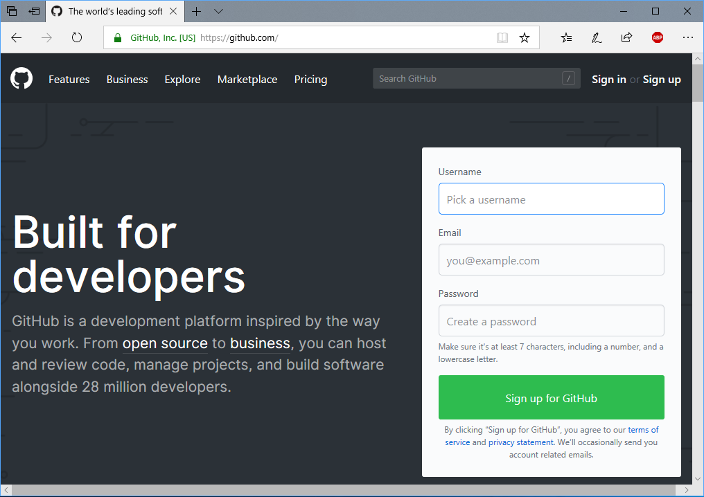

In general you will follow these steps:
* Create a personal account.
* Choose the free plan.
    * For now, you may choose not to set up an organization.
    * You may also choose not to receive GitHub emails.
* You are given a short survey.
    * You may skip the survey by scrolling to the Submit button at the bottom and clicking *skip this step*.
* Finally, verify your account by going to your email and following the instructions (clicking on the *Verify email address* link).

## Create your first repository
You now have a GitHub account with no repositories.  We will make one on the GitHub web site and clone it to your local machine.

There are many ways to create a GitHub repository on GitHub.  The following directions will work on any page on the desktop web site because we use the controls in the upper right corner.

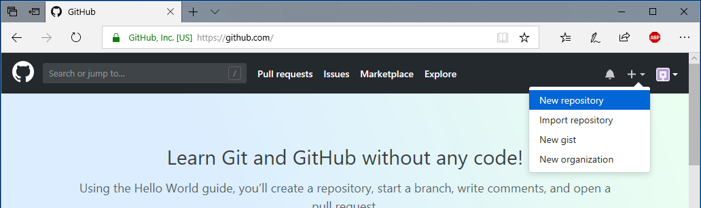

### Fill in the Create A New Repository form
These choices were made purely to demonstrate all the features of this form:

* Enter a repository name (we used *HelloWorld*).
* Enter a description (optional).
* Select the *Public* option.
    * Private repositories are available to paid GitHub subscribers.
* Check the *Initialize this repository with a README* box.
* Select a *.gitignore* from the drop down.
    * You can "search" for gitignores, such as the popular VisualStudio one for .NET developers
* Select a license (optional)
* Click the green *Create repository* button

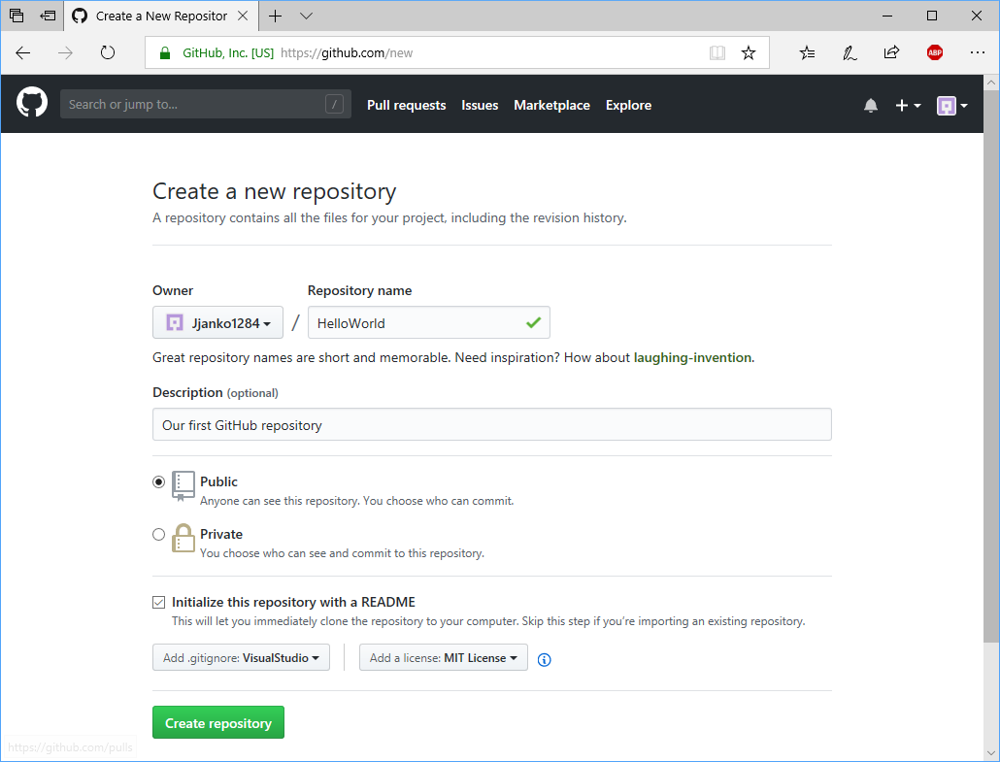

## Look around your new repository
You are taken directly to the "front page" of your new repository.  Note the following as you look around:

* You have three files: .gitgnore, LICENSE, and README.md.
* The contents of README.md are rendered just below the file listing.
    * Your repository name is the top header of the README file.
    * The description you entered is the text of the README file.
* You are viewing the master branch, the only branch of this repository on GitHub.
* The files created for you were automatically staged and committed as the first commit.
    * You can click on the words *1 commit* to view the commit history for this branch.

## Make a simple change on the GitHub website

Just to quickly put GitHub to work, you can make simple changes right on the web site.  For example, you can click the pencil icon in the upper-right corner of the README.md preview pane to edit the file right here on GitHub.

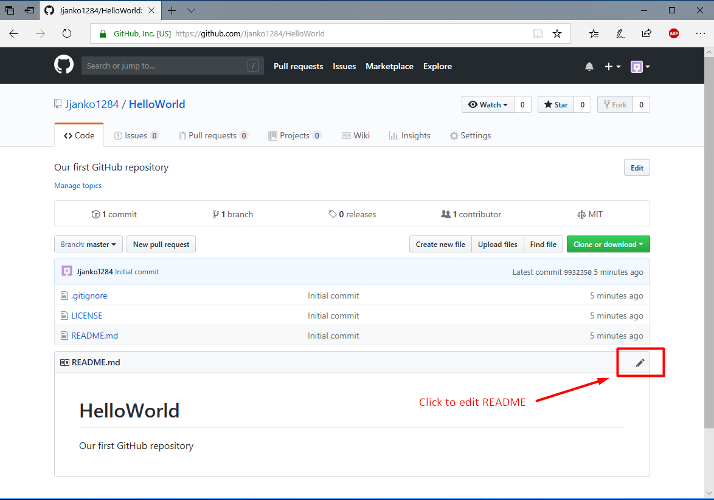

GitHub automatically renders an easy-to-edit format called Markdown.  This has become the favorite of documentation writers because it is very quick to use and supported in many major editors (including Visual Studio Code).

You will commit directly from here and to the master branch for this simple demonstration.

When you've clicked the pencil, a simple web-based text editor appears.  

* Add or change something in the text.
* Scroll to the bottom to see your options.
* Enter a title for your commit and a short description.
* Keep *Commit directly to the master branch* selected
* Click Commit Changes

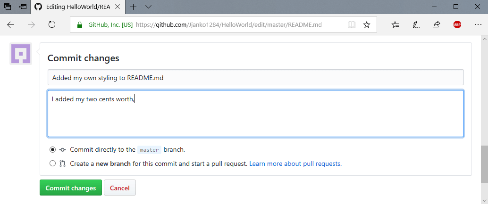

## Examine your changes
* Click the Code "tab" to go back to the "front page" of your repository.
* Note the README is rendered with your changes.
    * In every folder, GitHub will automatically render the contents of a file named README.md.  This is very useful for documentation.
* Note that the repository now says you have *2 commits*.  This is a clickable link, and it will take you to the log (history) for this branch.

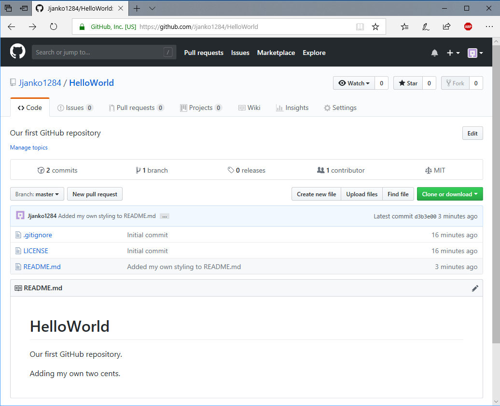

## Clone your repository
Now let's bring the repository down to your own machine.

Note: This demo uses `C:\Source` as our source folder location but this is up to your preference on your platform.

* Open a command prompt and switch to a folder where you are comfortable keeping your source
* Click on the green *Clone or download* button, and copy the link for https checkout.
* Type `git clone` and paste in the url you copied from GitHub.
    * The completed command looks similar to: `git clone https://github.com/<your_username>/HelloWorld.git`
* You should see Git copy the code to a subfolder named `HelloWorld` (or your name for the repository).

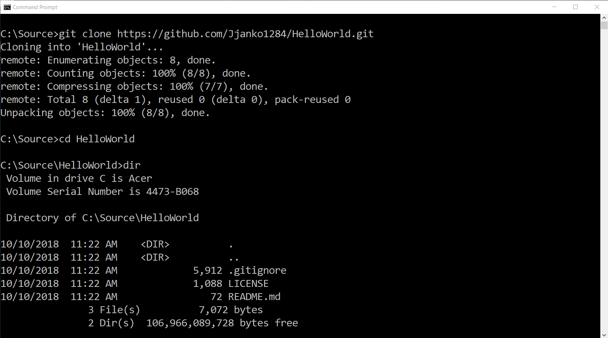

Congratulations! You now have a clone of your repository from GitHub.

## Work locally and push to Github
* Open your favorite text editor and change the README.md file again.
* *Optional: In Visual Studio Code, you can open a Markdown preview window. (Ctrl+K, V)*
    * More about Markdown [below](#extra-credit-learn-more-about-markdown)
* When you have changed and saved the file, go back to your command prompt.
* Use the `git add` command to stage the change.
    * This could be `git add README.md` or `git add .`
* Use `git commit` command to commit to your local git repository.
    * Notice that this does nothing on GitHub.  You are working separately.
* Use `git push` or `git push origin`
    * Git automatically creates a *remote* and calls it *origin* when you clone a repository.  It sets origin's location to the repository you clone from.  That's why *origin* is optional in the command above.

### Issues with pushing to the Github repository
Here is a place where you could get hung up.  If you have never pushed to your own GitHub repositories before, you will need to provide credentials to push via HTTPS.

On Windows, the credential store will automatically take your credentials and store them for use on this machine with Git.  You should only have to do this once.

Notes:
* Many Mac and Linux users will use SSH and are comfortable with SSH.
    * Mac users may want to read this from Github about [Caching your GitHub password](https://help.github.com/articles/caching-your-github-password-in-git/#platform-mac)
* Recent versions of Windows 10 include an SSH client and you can use it, but this is out of scope of this tutorial.
* You may also use Git Bash and setup SSH within that.
* Many Git GUI tools will create ssh keys and push them to git on your behalf (i.e. Github Desktop).

## Extra Credit: Learn more about Markdown
Markdown has quickl;y become a favored way to write documentation and get some basic styling that is especially useful to developers.

Feel free to make extra commits to play with this.

GitHub is famous for its [GitHub Flavored Markdown](https://guides.github.com/features/mastering-markdown/)

Besides basic formatting, there is support for:
* Code syntax highlighting (look at this README source)
    * Backticks for `inline code`
    * Three backticks for "code fencing"
    ```
    // Code here!
    ```
    * Specific language support
    ```javascript
    if (isAwesome) {
        // some would say this code is unreachable
        return true
    }
    ```

    ```sql
    SELECT Employee, Manager FROM People
    WHERE ManagerID=1
    GROUP BY Team
    ORDER BY StartDate
    -- Don't judge my T-SQL please
    ```

* Linking to other GitHub users (@user)
* Referencing Issues and Pull Requests
* Emojis

#### Windows Users
If you have not pushed to your Github account on your device, you should get the following dialog:


* This supports Github two-factor authentication so **use it!**

*Extra credit: Where are these credentials stored in Windows and can you reset it?*
* *Answer: They are stored in Credential Manager.  Look for the Generic Credential called `git:https://github.com`*

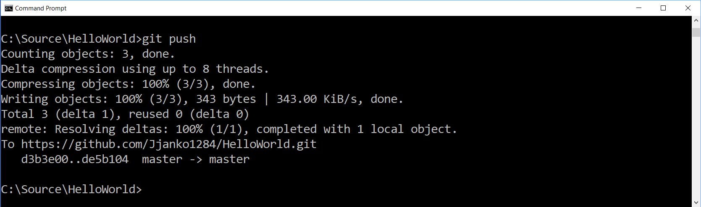

### You pushed to GitHub!
You should now see your push operation succeeded.  Head back to Github to check it out!

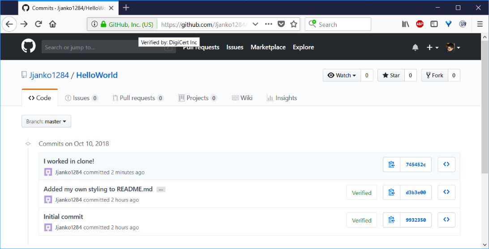

## Fork a Repository
You can clone and push to repositories you have access to on GitHub.  However, there are other reasons you might need to learn the Fork process.

* An open-source repository on GitHub.
    * It would be too difficult to manage who can and can't contribute for a large and important open-source project.
* A repository at work.
    * At work you will likely have direct commit access.
    * You could still consider forking a repository to have a space to experiment!
* A repository on another platform.
    * Although not covered tonight, you can also fork and/or clone from other platforms like [Azure Repos](https://azure.microsoft.com/en-us/services/devops/repos/) or [Bitbucket](https://bitbucket.org/).

### Choose a partner
Select a partner and find their repository. The address should be:

`https://github.com/<user_name>/<repository_name>`

You can also search for users directly on GitHub.

When you have found the repository, click the Fork button.
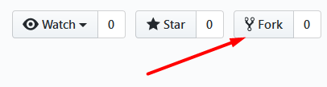

You'll see GitHub tell you to wait just a moment, and then you will see the same repository now in *your* GitHub account.

Now you should have a fork.  Notice that in the screenshot below, GitHub tells you that you forked the repository from somewhere else.


### Clone your copy of the repository
Use `git clone` to bring this to your local machine.
(We're testing you here to see if you can do it on your own now.)

GitHub will pay attention to when you commit here and suggest operations that help you contribute back to the original repository, but don't get too concerned about some kind of "link" or "lock".  Remember this is a completely seperate repository.

### Create a branch, and make a change
Create a new branch to work on:
* `git checkout -b start_website`
    * You may name the branch anything you like.

As you've done before:
* Make a change to a file or two.
    * You can choose to add files, or modify the text already in place in one of the exiting files.
    * Stage the changes (`git add`).
    * Commit the changes (`git commit`).
    * Push the changes to your repository with `git push`

Uh-oh! You *should* get a message from git that looks like this:
```
fatal: The current branch start_website has no upstream branch.
To push the current branch and set the remote as upstream, use

git push --set-upstream origin start_website
```

Wow that is scary, especially with the word **fatal** in there.  Fortunately, this is easy to fix, and Git even tells you how.

The issue is that Git does not know which branch to push to from this local branch.  The command:
    
    git push --set-upstream origin start_website

Means:
    * Remember that I want to "track" what's happening at the origin remote on the start_website branch relative to this branch.

You could set the upstream tracking branch separately, but quite often you will do this when you are pushing a new branch from your local repository to the remote for the first time.

Once you push these changes to YOUR repository, you should see a notification on the GitHub website:

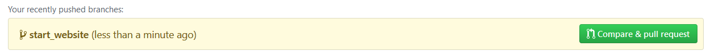

### Creating Issues and Pull Requests on GitHub
Often it is a good idea to create an issue in the repository you are contributing to.  This allows you and the maintainers to discuss if they are interested in the contribution.  You also might discuss how to implement the change.

* Go back to the repository you want to contribute to.  This is NOT your repository.  This is the repository you forked FROM.

#### Create an Issue
* Go to issues by clicking on the Issue "tab"
    * You may have noticed that GitHub removes the Issue tab when you are in a forked repository.

* Click on the green New Issue button.
* Note that you can converse about the issue in this "chat stream".
* You can also include code snippets directly from the repository and comment on them (although this does not seem to work for markdown).

#### Create a pull request so your changes are added
* Click on the pull request "tab"
* You should still see a button reminding you of your recent changes.  You can click that button to easily start a pull request.
* Note that the Open Pull Request form shows you the source and target of the changes you are contributing.

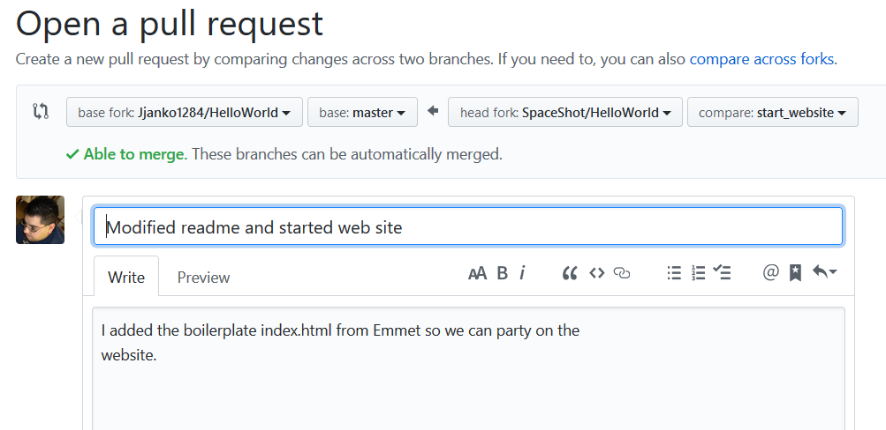

* Note that you can reference an issue with a pound sign (#) such as `#1`.
* You can click the preview tab to see what your comment will look like.

#### Conversation about the pull request
* Note that you can converse about the pull request, even making specific comments about the code line-by-line.

#### Finally, merge the pull request
* At this point, your branches should be able to be automatically merged.  Go ahead and merge the pull request.

## What else can we do?
Depending on time remaining we may:

* Delete the branch in the forked repository after the pull request is accepted.
* Add pull requests to an in-progress pull request.
* Sync up your fork with the original repository so you can keep working.
* Delete our repository on GitHub, but keep the local one so we can see what it is like to push an existing repository to GitHub.