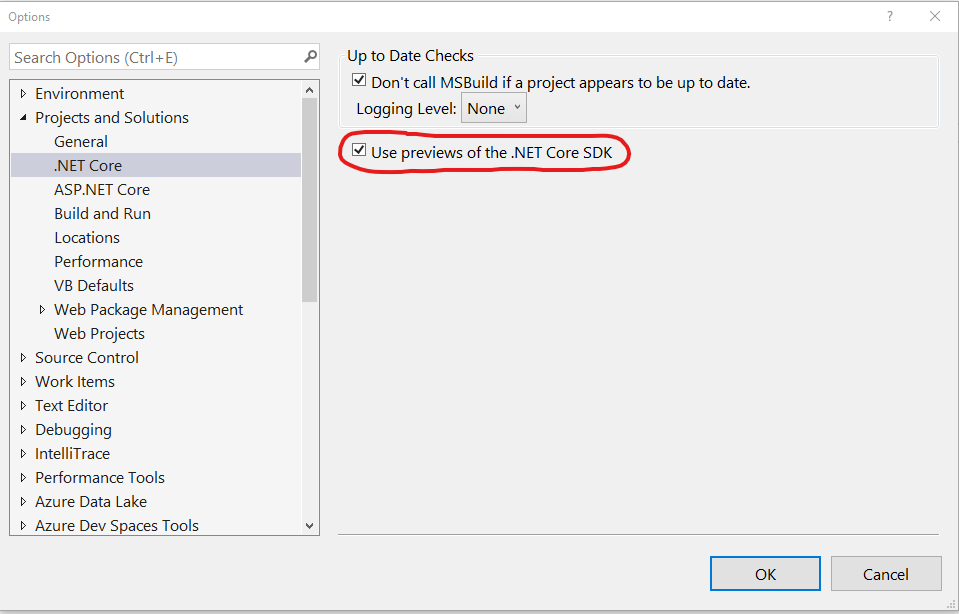

# Visual Studio 2019 and .NET Core Hands-On Lab

**April 3rd, 2019 5:45PM EDT (UTC -4)**

This lab will focus on Visual Studio 2019 and getting the most out of the new features.  

However, even if you do not have VS 2019, you may find some value in the Live Share and .NET Core topics.  

To help get you started, please read the prerequisites.

## Watch Live
You can watch the lab live on any of our streaming platforms:
- Mixer: https://mixer.com/phillysotnet
- YouTube: https://youtube.com/phillydotnet
- Twitch: https://twitch.tv/phillydotnet

## Replay
The recording of this lab will be available at our [YouTube Channel](https://youtube.com/phillydotnet) along with all past recordings and content.

## Prerequisites
Please make sure your device is ready with the following prerequisites:
1. Visual Studio 2019, any edition.
    - You can download from https://visualstudio.microsoft.com/.
    - Community edition is free and bits are identical to Professional.
    - For the purposes of this lab, it is recommended you install:
        - ASP.NET and web development workload
            - .NET Core 2.2 development tools
            - Live Share
        - Git for Windows (under Individual components)
        - GitHub extension for Visual Studio
        - [Optional] The .NET desktop development workload
1. You can also complete many items in the lab with Visual Studio Code, which is available for all platforms at: https://code.visualstudio.com/Download
1. .NET Core 2.2 SDK 2.2.105 : https://dotnet.microsoft.com/download/dotnet-core/2.2
1. Have your Microsoft account or GitHub account handy for Live Share
1. You can save some time by making sure you are set up for Live Share
    - Installation Instructions from the Official Docs: https://docs.microsoft.com/en-us/visualstudio/liveshare/
    - Visual Studio Code users can complete the *Install* and *Sign-In* portions to save time: https://docs.microsoft.com/en-us/visualstudio/liveshare/use/vscode
    - Visual Studio users can complete the *Install* and *Sign-In* portions to save time: https://docs.microsoft.com/en-us/visualstudio/liveshare/use/vs    
1. [Optional] .NET Core 3.0 preview SDK (preview 3) : https://dotnet.microsoft.com/download/dotnet-core/3.0

Note that everything above is the latest as of the writing and delivery of the lab.

Most attendees will install these for Windows, but Mac and Linux users can follow along with the .NET Core portions and Live Share portions using Visual Studio Code.

# A Tour of Visual Studio 2019 

# Visual Studio Live Share
Visual Studio Live Share is an amazing collaboration tool that is "in the box" in Visual Studio 2019.  It is available as an extension in Visual Studio 2017 and as an extension of Visual Studio Code.

# .NET Core in Visual Studio 2019
.NET Core 2.2 is the latest version of .NET Core.  Visual Studio 2019 has tooling for .NET Core 2.2

.NET Core 3.0 is in preview, but you can install preview tooling in Visual Studio.

The easiest and perhaps best way to use preview tooling (for .NET Core 3.0 including Blazor) is to install VS 2019 Preview side-by-side and use that.

However, if you want to enable .NET Core previews in the released product you can do so.  **You do not have to do this in VS 2019 Preview**
- Go to *Tools > Options* and find *Projects and Solutions > .NET Core*.  
- Check the "Use previews of .NET Core SDK" box

