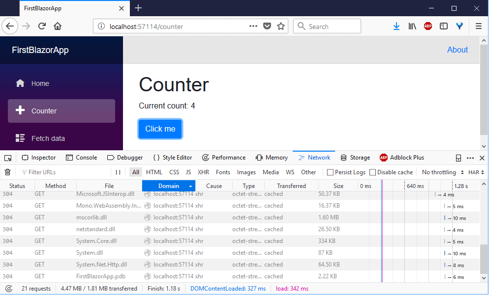

# Philly.<span>NET</span> Blazor Hands-On Lab

**July 10th, 2019 6:00PM EDT (UTC -4)**

To help get you started, please read the prerequisites.

## Watch Live
You can watch the lab live on any of our streaming platforms.  Questions from the chat rooms will be asked live at the meetup:
- Mixer: https://mixer.com/phillydotnet
- YouTube: https://youtube.com/phillydotnet
- Twitch: https://twitch.tv/phillydotnet

## Replay
The recording of this lab will be available at our [YouTube Channel](https://youtube.com/phillydotnet) along with all past recordings and content.

## Prerequisites
Please make sure your device is ready with the following prerequisites:
1. Visual Studio 2019 **Preview**, any edition (Community, Professional, or Enterprise).
    - You can download from https://visualstudio.microsoft.com/vs/preview/.
    - Community edition is free and bits are identical to Professional.
    - For the purposes of this lab, it is recommended you install:
        - The .NET desktop development workload
    - *[OPTIONAL]* You can also complete many items in the lab with Visual Studio Code, which is available for all platforms at: https://code.visualstudio.com/Download

1. .NET Core 3.0 preview SDK (preview 6) : https://dotnet.microsoft.com/download/dotnet-core/3.0. **(NOTE:  .NET Core 3.0 previews do not install with Visual Studio.  This is a separate download/install)**

1. Install the Blazor templates from the command line:

        dotnet new -i Microsoft.AspNetCore.Blazor.Templates::3.0.0-preview6.19307.2

1. If using Visual Studio, install the [Blazor extension](https://marketplace.visualstudio.com/items?itemName=aspnet.blazor).

Note that everything above is the latest as of the writing and delivery of the lab.

Most attendees will install these for Windows, but Mac and Linux users can follow along with the C# 8 portions using Visual Studio Code.

**Mac Users** - This blog post from Fabio Cozzolino demonstrates developing Blazor apps on a Mac with Visual Studio Code: [Develop a Blazor project with Visual Studio Code on Mac](http://www.fabiocozzolino.eu/develop-blazor-project-visual-studio-code-mac/).

### Setup for Blazor
See Microsoft's documentation for Blazor setup for any last minute changes or for details on using Visual Studio Code or .NET Command Line Tools

- [Get started with ASP.NET Core Blazor](https://docs.microsoft.com/en-us/aspnet/core/blazor/get-started?view=aspnetcore-3.0&tabs=visual-studio)   

# Hands-On Lab: Getting Started With Blazor


[//]: # (Part II Content Below Here)

## Create your first Blazor app
### File > New Project
In Visual Studio, From the File > New Project menu, select a new ASP.NET Core Web Application:


### New Blazor Application
In Visual Studio, select **Blazor** in the New ASP.NET Core Web Application dialog:


#### (Creating Project from Command Line)
Alternatively, you may also create this application from the command line with:

    dotnet new blazor -o FirstBlazorApp

*(This creates a new blazor app in the FirstBlazorApp subfolder from your current command line location.)*

## Run the new Blazor App
Go ahead and run the new app via IIS Express by pressing **F5** and check out the application.

*(If using Visual Studio Code or another editor, you should run the application using `dotnet run` from the command line)*

This application is running completely in the client. Don't believe it?  Open your web browser developer tools (F12) and look at the Network section.

Reload the page to see the assets load from the server.  Notice that when you switch between the Home "tab" and the Counter "tab", no new network calls are made.  Everything is being updated in the client even though there is no JavaScript code in the application.

You can also click the button in the Counter tab, and the page is updated with the click count.  No page refresh or server-side request is made.



*(You might notice that clicking on the **Fetch data** tab causes a network call, but this is to obtain the JSON to build the table, much like an HTTP request. The browser is all still updated client-side!)*

## Adding a new page
Let's add a new page that represents a team roster.

Add a new file to the Pages folder named **Roster.razor**.  You can also do this by right-clicking the Pages folder and choosing Add New Item... and creating a Razor View.  

*(Blazor tooling is still incomplete, so you can accomplish the same thing by just creating a Roster.razor text file.)*

### First steps
Type the following code into **Roster.razor**.  You will paste a complete implementation later, but try to type in this small sample.

    @page "/roster"
    
    <h1>Team Roster</h1>

    @if (roster == null)
    {
        <p><em>Loading...</em></p>
    }
    else
    {
        <pre>@roster</pre>
    }

    @functions {
        string roster;
    }

When you run this, you will find you have to navigate to `/Roster` yourself.  We have not added anything to the navigation menu, yet.

You will find that you have the layout, but the page never updates beyond "Loading...".  That's because we aren't taking any action in the page.

### Add Roster to Nav Menu
It will get annoying to navigate to the Roster page, so let's go ahead and add it to the NavMenu now:

Go to **Shared\NavMenu.cshtml** and examine how Blazor's Routing component sets up navigation.  The `<NavLink>` component is used to create an HTML link that obeys and triggers Blazor routing.

Add a new nav item to this list, anywhere you like, that looks like the following:
    
    <li class="nav-item px-3">
        <NavLink class="nav-link" href="roster">
            <span class="oi oi-list-rich" aria-hidden="true"></span> Team Roster
        </NavLink>
    </li>

### Dependency injection
So let's say we want to use a service to do something in our code.  Blazor's dependency injection model comes straight from ASP.NET Core's.

Add the following `@inject` directive at the top of the file (under the `@page` directive) to gain access to the .NET HttpClient:

    @inject HttpClient Http

Now we can make a simple Http request.

### Blazor page lifecycle
We can take action when a Blazor page is loaded, still writing C# code that will be executed in the browser.     

Add the following function to the `@functions` section:

    protected override async Task OnInitAsync()
    {
        roster = await Http.GetStringAsync($"https://randomuser.me/api/?results=10");
    }

At least you are now getting the JSON back from the web service.

### Deserializing and binding made easy
We're going to deserialize the JSON into plain C# objects.

Change the definition of `roster` in the `@functions` section to be a class that we are about to define.

```C#
TeamRoster roster;
```

Add the following classes to the bottom of the `@functions` section:

```C#
// C# classes to deserialize JSON
public class TeamRoster
{
    public Member[] results { get; set; }
}

public class Result
{
    public string gender { get; set; }
    public Name name { get; set; }
    public string email { get; set; }
    public Picture picture { get; set; }
}

public class Name
{
    public string first { get; set; }
    public string last { get; set; }
}

public class Picture
{
    public string thumbnail { get; set; }
}
```

Let's change the call to the API to the helpful **GetJsonAsync** extension method so we can directly deserialize to a **TeamRoster**:

```c#
roster = await Http.GetJsonAsync<TeamRoster>($"https://randomuser.me/api/?results=10");
```    

Now change the else block to match the following
    
```c#
else
{
    @foreach (var member in roster.results)
    {
        <p>
            @member.name.last, @member.name.first <br />
            Email: @member.email<br />
            
        </p>
    }
}
```

You may have noticed the page returns to you a "team roster" with randomly generated people.  It's not really a team roster because it's random every time.

Let's change that.

### Add data files to your application
Add the following files to your sample-data folder in wwwroot.  This will allow us to simulate calling an api and retrieving JSON.

- [roster.json](docs\files\roster.json)

Change the GetJsonAsync call to use this file instead:

```C#
roster = await Http.GetJsonAsync<TeamRoster>($"sample-data/roster.json");
```


### Simple routing
Go to **Shared\NavMenu.cshtml** and examine how Blazor's Routing component sets up navigation.  The `<NavLink>` component is used to create an HTML link that obeys and triggers Blazor routing.

Add a new nav item to this list, anywhere you like, that looks like the following:
    
    <li class="nav-item px-3">
        <NavLink class="nav-link" href="roster">
            <span class="oi oi-list-rich" aria-hidden="true"></span> Team Roster
        </NavLink>
    </li>

### Refactoring to models
Let's move those plain C# classes for deserialization to another file.

Create a Models folder and create a file called **RosterModels.cs**.  Let's move the user model classes over there now by copying the following code into **RosterModels.cs**:

``` C#
public class Result
{
    public string gender { get; set; }
    public Name name { get; set; }
    public string email { get; set; }
    public Picture picture { get; set; }
}

public class Name
{
    public string first { get; set; }
    public string last { get; set; }
}

public class Picture
{
    public string thumbnail { get; set; }
}
```
Finally, we want to remove those models from our **Roster.razor** file and add a `@using` directive at the top so the Roster page knows where to find the code:

    @using <yourappnamespace>.Models

*Note that you may be in a different namespace because of what you named your application.*

You've begun refactoring to a cleaner design!

### Adding interactivity
We used to add interactivity to HTML elements with attributes like `onclick`.  We have since tried to move to "[unobtrusive JavaScript](https://en.wikipedia.org/wiki/Unobtrusive_JavaScript)", but Blazor puts things like `onclick` back in style.

Add some Razor markup right after your `<h1>Team Roster</h1>` heading in **Roster.razor**:

    @if (!string.IsNullOrEmpty(saywhat))
    {
        <h3>Selected Teammates</h3>
        <p>&nbsp;@saywhat</p>
    }

Change the `` markup to add an attribute as follows:

    

You can see these working together to call a function named `SelectUser` that we haven't written yet.  Let's do that now.

Add these items to the `@functions` section. Put the field near the top with the parameter declaration and the function after our lifecycle method overrides:
```C#
private string saywhat;

void SelectUser()
{
    saywhat = "say what!";
}
```

This simple change will at least add interactivity.  Let's make one more change to a) pass a parameter to our click handler and b) update a list with selections.

### Advanced handlers with parameter passing
It's amazing, but you can pass parameters as well!

Change the `` element to call your function passing a lamdba expression:
```C#
 SelectUser(e, member)) />
```

We're going to keep a list of Result items now, so add this field in the `@functions` section:
```C#
private List<Member> selectedTeammates = new List<Member>();
```

Change `SelectUser()` to be a proper delegate that accepts an additional parameter of type `Member`.
```C#
private void SelectUser(UIMouseEventArgs e, Member teamMember)
{
    selectedTeammates.Add(teamMember);
}
```

For more on Event Handling see: https://docs.microsoft.com/en-us/aspnet/core/blazor/components?view=aspnetcore-3.0#event-handling

Finally, let's change the markup so it can accept this new list as it forms:

```C#
@if (selectedTeammates.Any())
{
    <h3>Selected Teammates</h3>
    <ul>
        @foreach (var teammate in selectedTeammates)
        {
            <li>@teammate.name.last</li>
        }
    </ul>
}
```

### Start breaking out child components
While this lab is not going to complete the project, we can still show how you can create and render child components.

Create a new folder called **Components** and create a Razor View (or plain text file) called **HeadingComponent.cshtml**

Let's create the markup for the child component, and we will not need any directives at all:

    <h3 style="font-style:@FontStyle; font-family:@FontFamily">@Content</h3>

Now the `@functions` section will declare the parameters used in the Razor markup:

    @functions {
        [Parameter]
        private string FontStyle { get; set; } = "bold";

        [Parameter]
        private string FontFamily { get; set; } = "sans-serif";

        [Parameter]
        private string Content { get; set; } = "Selections";
    }

All you need to do now is return to **Roster.razor** and replace the `<h3>` markup for selected teammates ( `    <h3>Selected Teammates</h3>`) with this:

    <HeadingComponent />

When you run the application now, you will see we've broken out our heading into a subcomponent, but we're letting it rely on default values.

### Passing parameters to child components
Try passing those parameters that were declared with the `[Parameter]` attribute:

    <HeadingComponent FontFamily="italic" FontStyle="serif" Content="Our Magnificent Team Selections" />